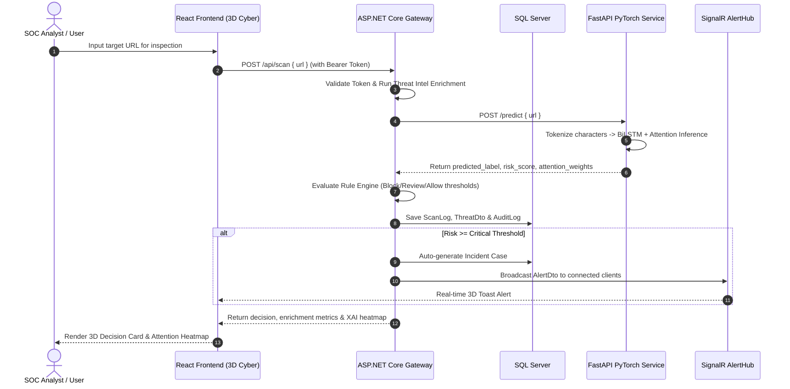

# SecureAI Architecture Specification

## 1. Overview

**SecureAI** is an AI-powered cybersecurity monitoring, threat intelligence, and decision support platform. The system is engineered to protect organizations and users from evolving cyber threats—focusing on phishing URL detection, malicious domain analysis, credential-harvesting email inspection, and active incident response.

The architecture is designed around four decoupled, scalable layers:
1. **Presentation Layer (Frontend)**: React 18, Vite, TypeScript, 3D Cyber Theme, Lucide Icons, Recharts.
2. **Application & Orchestration Layer (Backend Gateway)**: ASP.NET Core (.NET 10), Entity Framework Core, SignalR WebSocket Hub, Threat Intel Enrichment Engine.
3. **Intelligence & Inference Layer (AI Service)**: Python 3.11+, FastAPI, PyTorch (BiLSTM + Self-Attention), Scikit-Learn, LightGBM.
4. **Persistence & Data Layer (Database)**: Microsoft SQL Server (Entities, Audit Logs, Case Management, Hash Tokens).

---

## 2. High-Level Architecture Diagram

```text
┌──────────────────────────────────────────────────────────────────────────────────┐
│                                CLIENT / BROWSER                                  │
│                 React 18 + Vite + TypeScript (3D Cyber Theme)                    │
│      [Command Center]   [Manual Scan]   [Email Analyzer]   [Incident Cases]      │
└───────────────────────┬──────────────────────────────────┬───────────────────────┘
                        │ HTTP / REST                      │ WebSocket (SignalR)
                        ▼                                  ▼
┌──────────────────────────────────────────────────────────────────────────────────┐
│                             BACKEND GATEWAY (ASP.NET Core)                       │
│  - JWT Authentication & RBAC (Admin, Analyst, Viewer)                            │
│  - Threat Intelligence Enrichment Engine & Rule Engine                           │
│  - Audit Logs, Alert Workflow & Incident Management                              │
│  - Real-time AlertHub (SignalR WebSockets)                                       │
└───────────────────────┬──────────────────────────────────┬───────────────────────┘
                        │ Entity Framework Core            │ Internal REST / JSON
                        ▼                                  ▼
┌───────────────────────────────┐          ┌───────────────────────────────────────┐
│          DATABASE             │          │          AI INFERENCE SERVICE         │
│         SQL Server            │          │           FastAPI + PyTorch           │
│  - Users, Roles & Tokens      │          │  - BiLSTM + Self-Attention Model      │
│  - Threats, Alerts, Incidents │          │  - Email Feature Extractor (OCR/PDF)  │
│  - RuleConfigs & AuditLogs    │          │  - Baseline Benchmark Algorithms      │
└───────────────────────────────┘          └───────────────────────────────────────┘
```

---

## 3. Layer Breakdown

### 3.1 Presentation Layer (`secureai_frontend`)
- **Tech Stack**: React 18, Vite 5, TypeScript 5, Recharts, Lucide React.
- **Design Philosophy**: 3D Cyber / Glassmorphic SOC aesthetic with dark slate depth (`#080c15`), layered translucent cards with backdrop-filter blur, glowing neon status accents, and collapsible multi-category navigation.
- **Key Modules**:
  - `Home Command Center`: Live SOC operational status, 4-step incident workflow, high-impact CTA.
  - `Manual Scan`: Direct URL inference with instant risk scoring, ALLOW/WARN/BLOCK decision, and feedback loop.
  - `Security Dashboard`: 7-day threat trendline, label distribution donut chart, quick scan tool, and top high-risk list.
  - `Email Analysis`: Multi-factor email verification (SPF, DKIM, DMARC, brand spoofing, OCR/PDF extraction).
  - `Threat Intelligence`: Filterable threat database with export capabilities (CSV/PDF) and full URL enrichment metrics.
  - `Alerts & Incidents`: Real-time WebSocket incident management with status tracking (`Open` -> `Investigating` -> `Resolved` -> `FalsePositive`).
  - `Baseline Compare`: Side-by-side benchmark testing BiLSTM+Attention vs. LightGBM, Rule-based, and Blacklist.
  - `Rule Engine`: Visual slider interface for dynamic Block/Review threshold tuning and policy automation.

### 3.2 Application & Orchestration Layer (`secureai_backend`)
- **Tech Stack**: ASP.NET Core (.NET 10), Entity Framework Core, SQL Server.
- **Core Responsibilities**:
  - **Authentication & Authorization**: Role-Based Access Control (`Admin`, `Analyst`, `Viewer`) with JWT Access Tokens (480 mins) and cryptographically secure SHA-256 hashed Refresh Tokens (7 days, rotating on each use).
  - **Threat Intelligence Enrichment**: Parses target URLs for domain, TLD, SSL status, IP format, Punycode, subdomain depth, suspicious keywords, and path anomalies.
  - **Rule Engine Policy**: Applies dynamic organizational thresholds to convert AI raw probabilities into standardized actions: `BLOCK`, `REVIEW`, or `ALLOW`.
  - **Incident Automation**: High and Critical severity threats automatically spawn incident cases assigned to analysts.
  - **SignalR AlertHub**: Pushes instantaneous notifications to connected analyst browser sessions when critical threats are intercepted.

### 3.3 Intelligence & Inference Layer (`secureai_ai`)
- **Tech Stack**: Python 3.11+, PyTorch, FastAPI, Uvicorn, Scikit-learn, LightGBM.
- **Core Responsibilities**:
  - **Character-Level Tokenization**: URLs are processed as raw character sequences without external DNS dependency, resilient against newly registered zero-day domains.
  - **BiLSTM + Self-Attention**: Two-directional recurrent layers capture long-range contextual relationships; the Self-Attention mechanism highlights anomalous character clusters.
  - **Explainable AI (XAI)**: Generates character-level attention weights for real-time heatmap visualization.
  - **Email Parsing & OCR**: Extracts email fields from raw text, screenshots, or PDF attachments.
  - **Model Versioning**: Manages model artifacts (`Attention_BiLSTM.pt`, `char2idx.pkl`, `config.json`).

### 3.4 Data & Persistence Layer
- **Tech Stack**: Microsoft SQL Server.
- **Tables**:
  - `Users`, `RefreshTokens`: Identity & access governance.
  - `Threats`, `AnalystNotes`: Intercepted malicious indicators, enrichment metadata, and analyst notes.
  - `Alerts`: Real-time operational alarms with read/unread and investigation status.
  - `Incidents`: Case management lifecycle tracking.
  - `RuleConfigurations`: System-wide threshold configurations.
  - `AuditLogs`: Immutable tracking of security modifications and administrative actions.

---

## 4. Data Flow & Security Sequence



---

## 5. Security & Compliance Principles

1. **Defense-in-Depth**: Multi-layered defense incorporating client-side validation, gateway threat enrichment, neural network classification, and human-in-the-loop analyst feedback.
2. **Zero Plaintext Secrets**: All sensitive secrets (JWT private key, database connection strings) are injected via environment variables (`.env`) or User Secrets, excluded from Git.
3. **OWASP Top 10 Compliance**:
   - Injection prevention through parameterized Entity Framework queries.
   - Cross-Site Scripting (XSS) mitigated by React DOM sanitization.
   - Cross-Origin Resource Sharing (CORS) restricted to verified frontend origins.
   - Cryptographic protection: BCrypt password hashing, SHA-256 refresh token hashes.
4. **Explainable AI Ethics**: Transparent threat decisions with visual Attention Heatmaps ensure decisions can be audited and justified by human security analysts.
