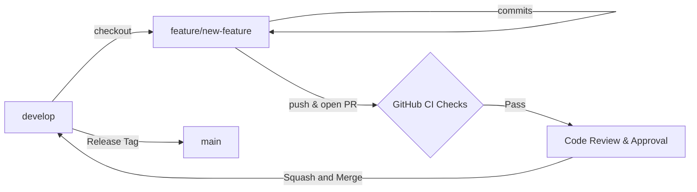

# SecureAI - Chiến lược Quản lý Nhánh Git (Branching Strategy)

Dự án **SecureAI** áp dụng mô hình phân nhánh chuẩn **Git Flow kết hợp GitHub Flow** nhằm đảm bảo mã nguồn trên nhánh chính luôn trong trạng thái ổn định và sẵn sàng triển khai (Production-ready).

---

## 1. Cấu trúc Nhánh Cốt lõi (Core Branches)

| Tên nhánh | Mục đích sử dụng | Chính sách bảo vệ (Branch Protection) |
| :--- | :--- | :--- |
| `main` | Mã nguồn Production chính thức | Yêu cầu PR review, bắt buộc vượt qua CI Check, cấm Force Push |
| `develop` | Nhánh tích hợp các tính năng chuẩn bị cho bản phát hành tiếp theo | Tự động chạy kiểm thử CI khi có commit |

---

## 2. Quy ước Đặt tên Nhánh Phụ (Supporting Branches)

Khi phát triển tính năng hoặc sửa lỗi, lập trình viên tạo nhánh mới từ `develop` theo quy ước:

```text
<prefix>/<tên-ngắn-gọn-mô-tả>
```

- **Tính năng mới (`feature/`)**:  
  `feature/bilstm-attention-optimization`  
  `feature/dark-mode-theme-toggle`  
  `feature/ocr-pdf-email-extractor`
- **Sửa lỗi (`fix/` hoặc `bugfix/`)**:  
  `fix/mojibake-vietnamese-encoding`  
  `fix/email-api-hardcoded-endpoint`  
  `fix/sidebar-responsive-collapse`
- **Tối ưu hóa hiệu năng & Refactor (`refactor/` hoặc `perf/`)**:  
  `refactor/rule-engine-state-management`  
  `perf/batch-url-inference`
- **Tài liệu (`docs/`)**:  
  `docs/add-competition-submission-guide`  
  `docs/api-swagger-documentation`

---

## 3. Quy trình Đóng góp Mã nguồn qua Pull Request (PR Workflow)



1. Cập nhật nhánh `develop` mới nhất từ remote:
   ```bash
   git checkout develop
   git pull origin develop
   ```
2. Tạo nhánh làm việc:
   ```bash
   git checkout -b feature/amazing-feature
   ```
3. Commit mã nguồn tuân thủ theo chuẩn **Conventional Commits**:
   ```bash
   git commit -m "feat(scan): add multi-threaded URL batch inference"
   ```
4. Đẩy nhánh lên GitHub và mở **Pull Request** trỏ về nhánh `develop`:
   * Mô tả rõ bối cảnh và các thay đổi đã thực hiện.
   * Gắn nhãn liên quan (e.g., `enhancement`, `bug`).
   * Đảm bảo toàn bộ quy trình kiểm thử CI tự động chạy thành công.
5. Sau khi được duyệt (Approved), PR sẽ được gộp vào nhánh chính bằng phương thức **Squash and Merge**.
